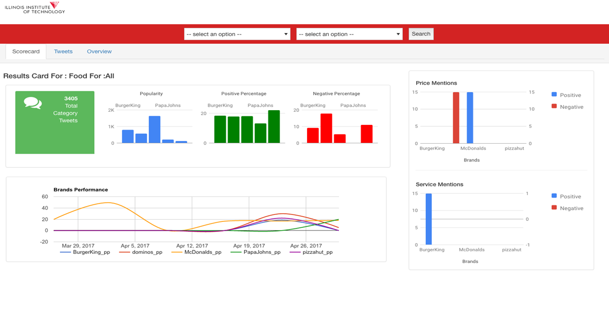

# Customer_Voice_Analysis_-Twitter_Sentiment_Analysis-
CS 522- Advanced Data Mining Project.
<li>Crawled Twitter data across various brands in different categories (Food, Retail, and Clothing).
<li>Cleaned the tweets using Natural Language Processing steps to clean the data. Found most common words.
<li>Label tweets using vader sentiment and Textblob.
<li>Created different machine learning models pipeline using Logistic Regression, Multinomial Naive Bayes, Support Vector Machine, Stocastic
Gradient Descent, Passive Aggressive Classifier to predict the sentiments.
<li>Created a Data Visualization dashboard to display how the brand is performing with respect to popularity, positive and negative sentiments across different citites in US. Hosted on AWS.
<li> Technology:  Python, scikitlearn, nltk, NLP, flask, html5, bootstrap, Twitter Stream/Search API, AWS EC2, Amazon Cloud.
  
 <b>Result</b>
 <li>Dashboard
  The dashboard displays tweets across one month timespan. People tweeted more about McDonalds at the start of April. Also the number of price and service mentioned tweets are displayed at the right hand side. 
  
